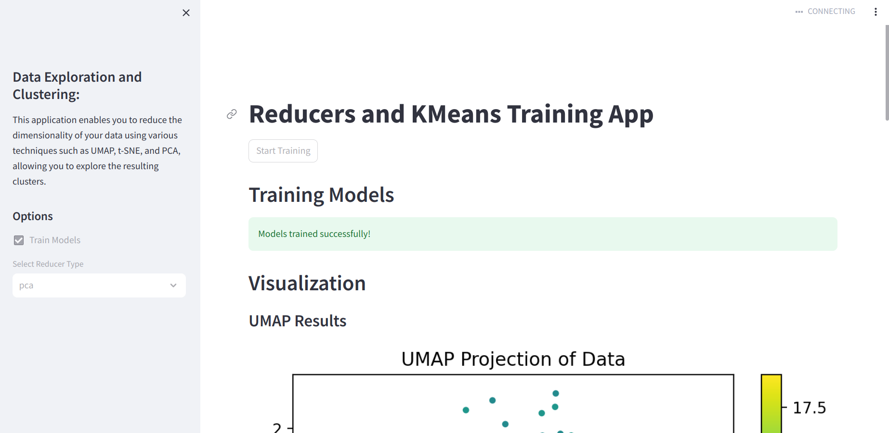

# Reducers and KMeans Training App


## Repository details

    ├── .git/ # git logs file 
    ├── .gitignore # git ignore file 
    ├── data/  # corpus data stored in  data folder
    │   └── ng20_data.joblib
    ├── dockerfile # Docker file to create an image docker 
    ├── main.py # main file that contains streamlit app execution
    ├── models/ # pickles models folder
    │   ├── K-means/
    │   │   └── kmeans_umap.pkl
    │   └── reducers/
    │       └── umap_model.pkl
    ├── notebooks/  # notebook folder for testing
    │   └── umap_method_testing.ipynb
    ├── readme.md
    ├── requirements.txt
    ├── src/
    │   ├── __pycache__/
    │   │   └── utils.cpython-310.pyc
    │   └── utils.py
    └── tree.py

# repo clonning

```
git clone https://github.com/Oussamayousre/exam_project.git
```

# Requirements

```
# this command is to install necessary requirements to use the streamlit application
pip install -r requirements.txt
```
# Application run 
 
## without docker 

```
python main.py
# then you can easily interact with the streamlit app 
```
## Docker 

```
docker build -t reducer_app .
docker run reduce_app 
```
# Streamlit UI 
### the entire streamlit page 

### UMAP reducer projection of data

### K means projcection of its results 

# Project Step : 
To deploy the project on GitHub and have each group member develop a different method, we followed the following steps:
- Created a new repository named "exam_project" for the project on GitHub.
- Each member cloned the repository to their local machine using the command:
  git clone https://github.com/Oussamayousre/exam_project
- Each member created a branch.
- Each member switched to their branch using the command:
  git checkout 'branch_name'
- Each of us created a .ipynb file and developed our method. Then, we saved our changes using the commands:
  git add .
  git commit -m 'commit message'
- Each member pushed to their branch using the command:
  git push -u origin branchName
- Finally, we used the pull request function on GitHub to merge each branch with the main branch "main."